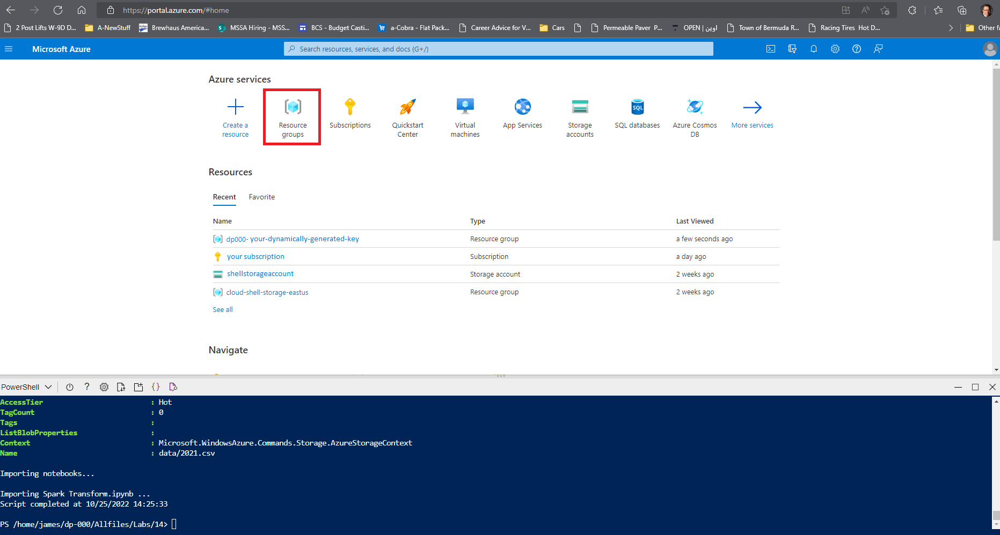

---
lab:
    title: 'Transform data using a serverless SQL pool'
    module: 'Use Azure Synapse serverless SQL pool to query files in a data lake'
---

# Transform files using a serverless SQL pool

Data *analysts* often use SQL to query data for analysis and reporting. Data *engineers* can also make use of SQL to manipulate and transform data; often as part of a data ingestion pipeline or extract, transform, and load (ETL) process.

In this lab, you'll use a serverless SQL pool in Azure Synapse Analytics to transform data in files.

This lab will take approximately **30** minutes to complete.

## Before you start

You'll need an [Azure subscription](https://azure.microsoft.com/free) in which you have administrative-level access.

## Provision an Azure Synapse Analytics workspace

You'll need an Azure Synapse Analytics workspace with access to data lake storage. You can use the built-in serverless SQL pool to query files in the data lake.

In this exercise, you'll use a combination of a PowerShell script and an ARM template to provision an Azure Synapse Analytics workspace.

1. Sign into the [Azure portal](https://portal.azure.com) at `https://portal.azure.com`.
2. Use the **[\>_]** button to the right of the search bar at the top of the page to create a new Cloud Shell in the Azure portal, selecting a ***PowerShell*** environment and creating storage if prompted. The cloud shell provides a command line interface in a pane at the bottom of the Azure portal, as shown here:

    

    > **Note**: If you have previously created a cloud shell that uses a *Bash* environment, use the the drop-down menu at the top left of the cloud shell pane to change it to ***PowerShell***.

3. Note that you can resize the cloud shell by dragging the separator bar at the top of the pane, or by using the **&#8212;**, **&#9723;**, and **X** icons at the top right of the pane to minimize, maximize, and close the pane. For more information about using the Azure Cloud Shell, see the [Azure Cloud Shell documentation](https://docs.microsoft.com/azure/cloud-shell/overview).

4. In the PowerShell pane, enter the following commands to clone this repo:

    ```
    rm -r dp-000 -f
    git clone https://github.com/MicrosoftLearning/mslearn-synapse dp-000
    ```

5. After the repo has been cloned, enter the following commands to change to the folder for this lab and run the **setup.ps1** script it contains:

    ```
    cd dp-000/Allfiles/Labs/14
    ./setup.ps1
    ```

6. If prompted, choose which subscription you want to use (this will only happen if you have access to multiple Azure subscriptions).
7. When prompted, enter a suitable password to be set for your Azure Synapse SQL pool.

    > **Note**: Be sure to remember this password!

8. Wait for the script to complete - this typically takes around 10 minutes, but in some cases may take longer. While you are waiting, review the [CETAS with Synapse SQL](https://docs.microsoft.com/azure/synapse-analytics/sql/develop-tables-cetas) article in the Azure Synapse Analytics documentation.

## Explore the data
The script provisions an Azure Synapse Analytics workspace with a Spark Pool, Built-in Serverless SQL Pool, and an Azure Storage account to host the data lake, then uploads 3 sales orders files to the data lake and a Notebook to the workspace. Let's explore and work with the data using the provided notebook by following the steps below:

1. Select the Resource Groups option in the Azure Portal window  
2. Select the resource group which begins with dp000- and has the suffix created in your script. This should still be visible in your shell window and look similar to the code snippet below:
   
   ```powershell
   Your randomly-generated suffix for Azure resources is xxxxxx
   ```

3. Select the Synapse-xxxxxx workspace icon within the Resource Group panel. 
4. Select the **Open Synapse Studio** under the Getting started section of the Synapse Resource panel. If this doesn't work, then you can select the link in the **Workspace web URL**. 

### Navigate to Synapse Studio to view the raw data files loaded into the data lake. 

1. Open the **synapse*xxxxxxx*** Synapse workspace, and on its **Overview** page, in the **Open Synapse Studio** card, select **Open** to open Synapse Studio in a new browser tab; signing in if prompted.
2. On the left side of Synapse Studio, use the **&rsaquo;&rsaquo;** icon to expand the menu - this reveals the different pages within Synapse Studio.
3. On the **Manage** page, on the **SQL pools** tab, select the row for the **sql*xxxxxxx*** dedicated SQL pool and use its **&#9655;** icon to start it; confirming that you want to resume it when prompted.
4. Wait for the SQL pool to resume. This can take a few minutes. You can use the **&#8635; Refresh** button to check its status periodically. The status will show as **Online** when it is ready.