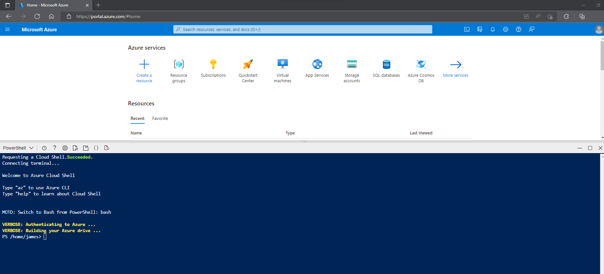

---
lab:
    title: 'Store and Manage Data in Data Lake'
    module: 'Get started with Azure Data Lake Storage Gen2
'
---
## Use spark notebooks in Synapse Pipeline

## Introduction

In this lab, we're going build an optimized structure for Azure Data Lake Storage based on the current best practices for Cloud Scale Analytics. This is to prevent the proverbial data swamp where data is improperly managed, has poor data quality, and very limited access to users. The goal of proper governance and organization will prevent a data swamp within your architecture.

This lab will take approximately **20** minutes to complete.

## Before you start

You'll need an [Azure subscription](https://azure.microsoft.com/free) in which you have administrative-level access.

## Provision a Resource Group

You'll need an Azure Resource group to start with, from there we can provision additional services to support this lab.

In this exercise, you'll use a combination of a PowerShell script and an ARM template to provision an Azure Synapse Analytics workspace.

1. Sign into the [Azure portal](https://portal.azure.com) at `https://portal.azure.com`.
2. Use the **[\>_]** button to the right of the search bar at the top of the page to create a new Cloud Shell in the Azure portal, selecting a ***PowerShell*** environment and creating storage if prompted. The Cloud Shell provides a command line interface in a pane at the bottom of the Azure portal, as shown here:

    

    > **Note**: If you have previously created a cloud shell that uses a *Bash* environment, use the the drop-down menu at the top left of the cloud shell pane to change it to ***PowerShell***.

3. Note that Cloud Shell can be resized by dragging the separator bar at the top of the pane, or by using the—, **&#9723;**, and **X** icons at the top right of the pane to minimize, maximize, and close the pane. For more information about using the Azure Cloud Shell, see the [Azure Cloud Shell documentation](https://docs.microsoft.com/azure/cloud-shell/overview).

4. In the PowerShell pane, enter the following commands to clone this repository:

    ```powershell
    rm -r dp-000 -f
    git clone https://github.com/MicrosoftLearning/mslearn-synapse dp-000
    ```

5. After the repository has been cloned, enter the following commands to change to the folder for this lab, and run the **setup.ps1** script it contains:

    ```powershell
    cd dp-000/Allfiles/Labs/18
    ./setup.ps1
    ```
    
6. If prompted, choose which subscription you want to use (this will only happen if you have access to multiple Azure subscriptions).
7. When prompted, enter a suitable password to be set for your Azure Synapse SQL pool.

    > **Note**: Be sure to remember this password!

8. Wait for the script to complete - this typically takes around 5 minutes, but in some cases may take longer. While you're waiting, review the [Overview of Azure Data Lake Cloud Storage](https://learn.microsoft.com/en-us/azure/cloud-adoption-framework/scenarios/cloud-scale-analytics/best-practices/data-lake-overview) article in the Azure Synapse Analytics documentation.